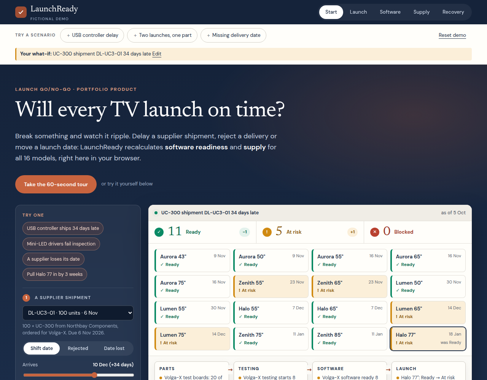
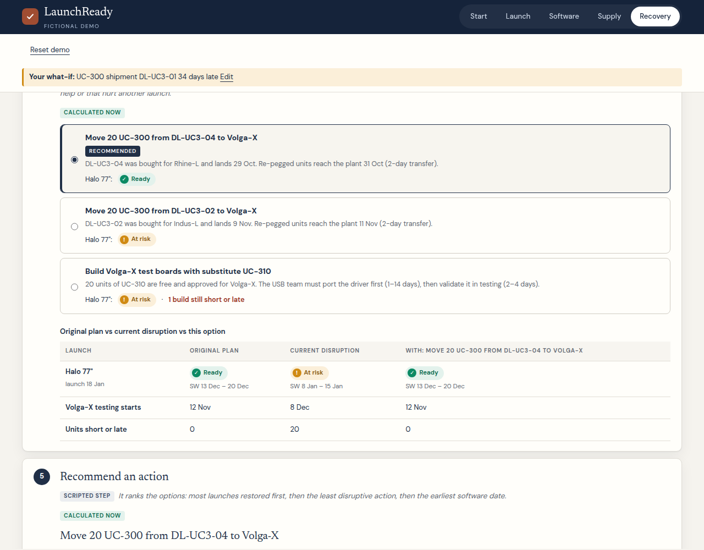
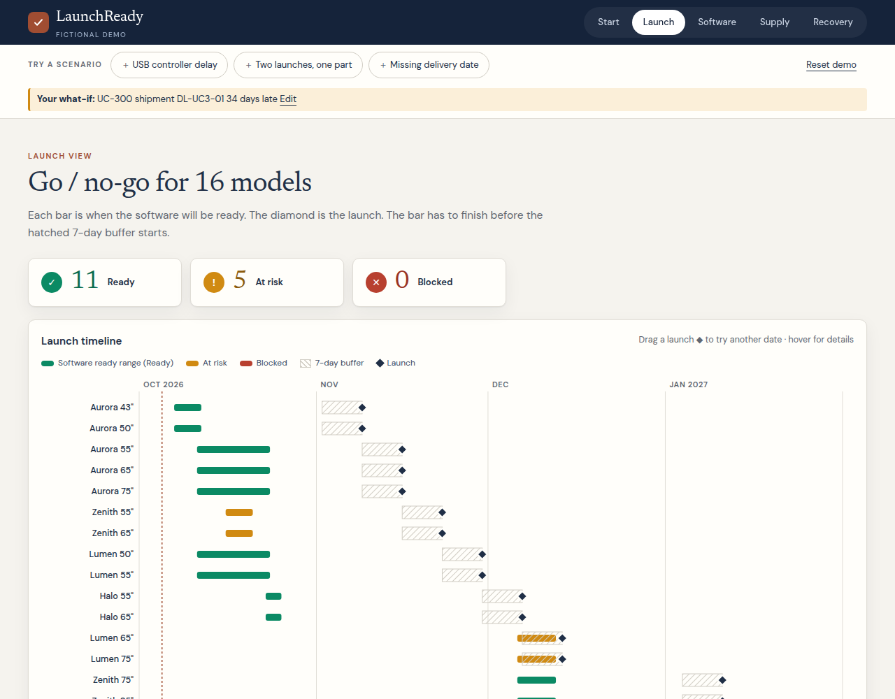
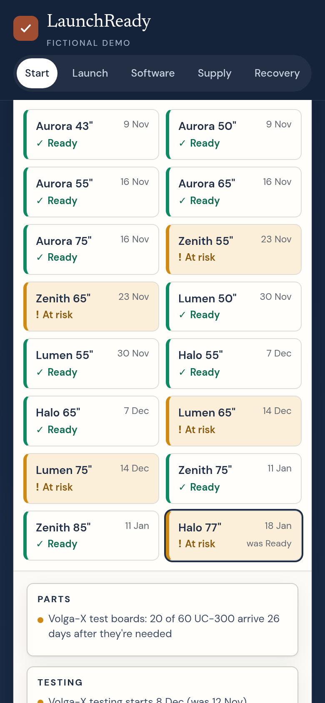

# LaunchReady

**A launch go/no-go tool for a fictional TV maker that joins software readiness and supply in one view.**

> Portfolio project by [Hemant Singla](https://hemant-singla.github.io). **Fictional company and data.** It isn't deployed, has no real users and claims no savings. Every date and quantity shown is calculated by the code in this repo.

**Live demo:** https://hemant-singla.github.io/launchready/ · **Product brief:** [docs/PRODUCT_BRIEF.md](docs/PRODUCT_BRIEF.md)







## What it is
A TV launch needs two things at once: software that's ready, and parts to build both the test boards and the TVs. They're usually tracked in different tools (issue trackers on one side, ERP and spreadsheets on the other). LaunchReady joins them:
- **Launch view:** Ready / At risk / Blocked for 16 models, with the reasons from both sides; filters by line, chipset and status.
- **Software team view:** each component team's code submission against the deadline, new vs reused code, open tickets by severity and age, and an estimated software-ready **range** per chipset.
- **Supply view:** stock by warehouse (including what's already allocated), supplier deliveries and delays, rejected shipments, approved substitutes, and which build gets which units.
- **What-if lab (start page):** pick any supplier shipment and move its date (14 days early to 60 days late), reject it or remove its date, or move a launch. All 16 launches recalculate as you drag, with the knock-on chain: parts → testing → software → launch. Launch dates can also be dragged on the timeline (or moved with ← / →).
- **Scenarios:** a USB controller delay, two launches competing for one part, and a delivery with no date. They stack with the lab. *Reset demo* restores the original data, filters, decisions and log.
- **Recovery workflow (simulated agent):** detect the change → pull the records → find affected launches → compare recovery options → recommend one with evidence and trade-offs → you approve or reject. Approving applies the action to the demo data and every view recalculates; rejecting changes nothing. Both go in the activity log.
- **Affected first:** with a disruption active, every view puts affected launches, chipsets and parts first, says why each matters, and offers *Affected only / Show all*. Launch details link to the software and supply evidence.
- **60-second tour:** a skippable walk through one delay, its impact, the recovery comparison and an approval.

The key link: **test boards need parts**. A late USB controller means fewer test boards, which means testing starts late and the software date slips. That chain crosses both tools, which is why it's usually discovered late.

## How the verdict is calculated
- **Software (per chipset):** test start = latest of planned start, code complete + 3 days, and test boards available. Ready range = the later of (test window + stabilisation tail) and (open-ticket fix days ÷ team capacity). Ready if the latest date is ≥ 7 days before launch, with no late code and no open criticals. Blocked if even the earliest date is after launch.
- **Supply (per model):** parts are handed out in need-date order, and each unit only once. Rejected and undated deliveries are never counted. Late, tight, substitute-dependent or undated coverage → At risk. Missing parts, or production parts more than 7 days late → Blocked.
- **Launch:** the worse of the two, with reasons from both. All thresholds are in [`data/config.json`](data/config.json).

## Recovery options
`src/recovery.js` generates only the actions the data supports, tests each one with the engine, and drops any that don't help or that make another launch worse:
- **Re-peg a purchase order** bought for another program (same part only). Units arrive 2 days after the order (transfer), and the other program keeps the rest.
- **Approved substitute** for test boards, if enough free substitute stock covers the whole gap (a partial substitute doesn't save the build). Adds the driver change before testing (1–14 days) and validation inside testing (2–4 days).
- **Move the launch** to the earliest date that restores the original verdict, up to 42 days.
- Undated and rejected deliveries are never used. If nothing resolves the issue, it says which launches remain and what to escalate.

## The agent: simulated in the app, real code in `agent/`
The **Recovery** tab is labelled **"Simulated agent workflow"**: its steps and wording are scripted, and every number on it is calculated in the browser by `src/`. No AI model runs on the site, and it needs no API key.
`agent/run.mjs` is a real tool-use loop with Claude (Sonnet 5.5) and 7 tools (`agent/tools.js`) that call the same logic. **No runs have been recorded yet** (it needs an API key). If runs are recorded later they're saved to `runs/` and must carry the label "Real agent run, recorded during the build and replayed" (a test enforces it).

## Publish
GitHub Pages serves `main` from the repository root (no build step). Push to `main` and Pages redeploys in a minute or two; all paths are relative, so it works under `/launchready/`.

## Run it
```bash
npm test                                  # 32 tests: logic, lab, recovery, agent tools (Node 20+, no installs)
python3 -m http.server 8000               # open http://localhost:8000
npm install && ANTHROPIC_API_KEY=... node agent/run.mjs   # record real agent runs (costs API credits; none recorded yet)
node tools/generate-data.mjs && node tools/data-overview.mjs   # rebuild data + docs/DATA.md
```
Plain HTML/CSS/JavaScript with no framework and no build step. [docs/CODE_WALKTHROUGH.md](docs/CODE_WALKTHROUGH.md) explains the code in five minutes.

## Honest limitations
- Fictional data, and the baseline was designed so the scenarios show clear effects.
- No real integrations (Jira, ERP, supplier portals); data quality is assumed.
- Simplified model: key parts only, one flat transfer time, no test-lab capacity, no costs or expediting.
- The rules (buffers, fix-time ranges, allocation order) are reasonable defaults, not validated ones.
- The agent workflow is simulated: scripted steps over calculated results. It is not an AI making decisions, and a human approves every action.
- One launch move at a time in the lab; recovery options are single actions (approve one, and the agent re-checks what's left).

More in the [product brief](docs/PRODUCT_BRIEF.md) §8.

<p align="center"></p>
